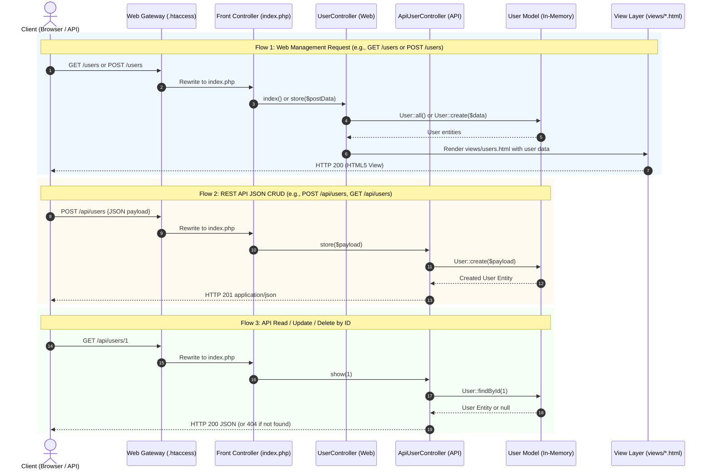

# Istanbul University Faculty of Economics — Management Information Systems (MIS) Alumni Portal & Tracking System

[](https://www.php.net/)
[](https://www.mysql.com/)
[](https://developer.mozilla.org/)
[](https://opensource.org/licenses/MIT)
[](https://www.istanbul.edu.tr/)

A comprehensive, enterprise-ready alumni tracking system and engagement portal designed specifically for the graduates, faculty, and administrative staff of **Istanbul University Faculty of Economics, Department of Management Information Systems (Yönetim Bilişim Sistemleri - MIS)**.

---

## Table of Contents

1. [Project Overview](#1-project-overview)
2. [Key Features & System Modules](#2-key-features--system-modules)
   - [2.1 Alumni Directory & Profile Management](#21-alumni-directory--profile-management-the-core-tracking-system)
   - [2.2 Career Services & Mentorship Hub](#22-career-services--mentorship-hub)
   - [2.3 Events & Reunions Management](#23-events--reunions-management)
   - [2.4 Fundraising, Giving & Campaigns](#24-fundraising-giving--campaigns)
   - [2.5 Community & Communication](#25-community--communication)
   - [2.6 University Perks & Services](#26-university-perks--services)
   - [2.7 Administrative CRM & Accreditation Analytics](#27-administrative-crm--accreditation-analytics-for-university-staff)
3. [Technology Stack](#3-technology-stack)
4. [Database & Architectural Design](#4-database--architectural-design)
   - [4.1 Relational Data Model & Entities](#41-relational-data-model--entities)
   - [4.2 MVC (Model-View-Controller) Architecture](#42-mvc-model-view-controller-architecture)
     - [Project Directory Tree](#project-directory-tree)
     - [Component Categorization & Architectural Roles](#component-categorization--architectural-roles)
     - [MVC Component Interaction & Request Lifecycle](#mvc-component-interaction--request-lifecycle)
     - [Swagger / OpenAPI 3.0 Documentation](#swagger--openapi-30-documentation)
5. [Setup & Usage Instructions](#5-setup--usage-instructions)
   - [Prerequisites](#prerequisites)
   - [Step 1: Clone or Extract the Repository](#step-1-clone-or-extract-the-repository)
   - [Step 2: Database Setup & Migration](#step-2-database-setup--migration)
   - [Step 3: Application Configuration](#step-3-application-configuration)
   - [Step 4: Running the Application](#step-4-running-the-application)
   - [Default Test Credentials](#default-test-credentials)
6. [Detailed Prompts Used During Development](#6-detailed-prompts-used-during-development)
   - [Prompt 1: Architectural Foundation & Database Schema Design](#prompt-1-architectural-foundation--database-schema-design)
   - [Prompt 2: Secure Dynamic Directory & Search Engine](#prompt-2-secure-dynamic-directory--search-engine)
   - [Prompt 3: Mentorship Pairing & Career Services Logic](#prompt-3-mentorship-pairing--career-services-logic)
   - [Prompt 4: Administrative CRM, Accreditation & KPI Analytics](#prompt-4-administrative-crm-accreditation--kpi-analytics)
   - [Prompt 5: Security Architecture & RBAC Hardening](#prompt-5-security-architecture--rbac-hardening)
7. [Contributing](#7-contributing)
8. [License](#8-license)
9. [Contact & Institutional Credits](#9-contact--institutional-credits)

---

## 1. Project Overview

The **Istanbul University MIS Alumni Portal** bridges the gap between past graduates, current students, faculty members, and university administration. Built specifically for the **Faculty of Economics Department of Management Information Systems**, this platform serves dual imperatives:

1. **Alumni Community Empowerment**: Provides graduates with a modern digital environment to network, find career and mentorship opportunities, coordinate reunions, access university library resources and campus perks, and support faculty fundraising campaigns.
2. **Institutional Tracking & Accreditation Analytics**: Equips faculty deans, department chairs, and quality accreditation coordinators (e.g., YÖKAK, AACSB, ABET criteria) with real-time empirical data regarding graduate employment rates, salary progression, industry distribution, geographic mobility, and employer satisfaction.

---

## 2. Key Features & System Modules

```
┌─────────────────────────────────────────────────────────────────────────────────┐
│              Istanbul University MIS Alumni Portal Ecosystem                    │
└──────────────────────────────────────┬──────────────────────────────────────────┘
                                       │
       ┌───────────────────────────────┼───────────────────────────────┐
       ▼                               ▼                               ▼
 ┌───────────────┐              ┌───────────────┐              ┌───────────────┐
 │ Alumni Portal │              │ Career Hub    │              │ Admin CRM &   │
 │ & Directory   │              │ & Mentorship  │              │ Accreditation │
 └───────────────┘              └───────────────┘              └───────────────┘
       │                               │                               │
       ├─ Directory Search             ├─ Job Board                    ├─ Graduate KPIs
       ├─ Privacy Toggles              ├─ Mentor Matching              ├─ YÖKAK Reports
       ├─ Career Timelines             ├─ Resume Reviews               ├─ Campaign Audit
       └─ Verified Badges              └─ Referral Network             └─ User Moderation
```

### 2.1 Alumni Directory & Profile Management (The Core Tracking System)
- **Granular Academic Tracking**: Records student ID, matriculation year, graduation year, degree level (B.Sc., M.Sc., Ph.D.), thesis topics, and faculty advisors.
- **Professional Career Timeline**: Tracks current company, job title, industry sector (e.g., FinTech, SaaS, ERP Consulting, Cybersecurity, Data Analytics), work location, and LinkedIn profile integration.
- **Parametric Multi-Filter Search**: Instant search filtering by graduation class, industry, country/city, current employer, skills, and availability for mentoring.
- **Privacy & GDPR/KVKK Compliance**: Configurable privacy controls allowing alumni to selectively hide contact info, phone number, or work details from public or peer view.
- **Verification Workflow**: Administrative approval pipeline to verify newly registered accounts against official Istanbul University student registrar records.

### 2.2 Career Services & Mentorship Hub
- **Alumni-to-Student & Peer Mentorship**: Mentors can advertise available slots, areas of expertise (e.g., Product Management, Cloud Engineering, Business Intelligence), and preferred meeting formats.
- **Internal Opportunity Board**: Alumni and partner companies can publish internships, junior roles, and executive openings targeted specifically at MIS graduates.
- **Direct Referral Request**: Secure channel for junior graduates to request internal referral endorsements from senior alumni working in target companies.

### 2.3 Events & Reunions Management
- **Departmental & Class Reunions**: Event publishing engine supporting annual department homecomings, batch-specific anniversary gatherings, and international meetups.
- **RSVP & Attendance Tracking**: Real-time RSVP counters, waitlists, attendee lists, and calendar integration (Google Calendar, iCal, Outlook).
- **Virtual Event Integration**: Built-in support for Zoom, Microsoft Teams, and Google Meet webinar URLs with access-gated attendee ticketing.

### 2.4 Fundraising, Giving & Campaigns
- **Departmental Initiatives**: Targeted campaigns for student scholarships, computer laboratory modernization, conference travel grants, and academic research funds.
- **Contribution Tracking & Transparency**: Milestone progress bars, anonymous donation options, donor recognition walls, and automated transaction receipts.
- **Pledge & Corporate Sponsorships**: Channels for corporate sponsorships from alumni-led enterprises.

### 2.5 Community & Communication
- **Special Interest Groups (SIGs)**: Community forums and thematic interest channels (e.g., *Data Science & AI*, *IT Project Management*, *ERP & SAP Specialists*, *Startups & Entrepreneurship*).
- **Direct Messaging**: Intra-platform peer messaging system with spam prevention and message encryption indicators.
- **Faculty Broadcasts & Newsletters**: Central announcement feed for department news, published papers, faculty awards, and curriculum updates.

### 2.6 University Perks & Services
- **Digital Alumni Pass**: Virtual identity card generating a secure QR code for campus gate entry (Beyazıt Main Campus, Faculty of Economics library).
- **Library & Research Access**: Instructions and federated credentials to access Istanbul University digital journals and academic repositories.
- **Alumni Discounts**: Directory of negotiated corporate discounts in education, software subscriptions, co-working spaces, and hospitality.

### 2.7 Administrative CRM & Accreditation Analytics (For University Staff)
- **Accreditation Readiness Dashboard**: Exportable metrics formatted for institutional review boards (YÖKAK, AACSB, MÜDEK/ABET) showing employment within 6/12 months of graduation.
- **Industry & Geographic Heatmaps**: Visual breakdowns of where Istanbul University MIS graduates reside and which market verticals hire them most.
- **Engagement & Retention Index**: Analytics measuring alumni activity, event attendance rates, and mentorship program health.
- **Role-Based Access Control (RBAC)**: Distinct permissions for Super Admin, Faculty Dean / Department Head, Career Coordinator, and Alumni Moderator.

---

## 3. Technology Stack

| Layer | Technology | Description |
|---|---|---|
| **Frontend UI** | HTML5, CSS3, Modern Vanilla JavaScript | Clean semantic layout, responsive CSS Grid / Flexbox, no heavy framework dependencies. |
| **Styling & Design System** | Custom CSS3 Design System | Institutional color palette (Istanbul University Navy `#003366`, Gold `#C5A059`, Slate `#F4F6F9`), accessible typography, dark/light theme ready. |
| **Backend Engine** | PHP 8.1+ (Native OOP / MVC) | Modular architecture, PSR-compliant structure, PDO database abstraction, session security. |
| **Database** | MySQL 8.0+ / MariaDB 10.4+ | Relational schema with normalized tables, foreign key integrity, and B-Tree indexing on search attributes. |
| **Authentication & Security** | PHP Native Password Hashing (Argon2id / Bcrypt) | CSRF tokens on all mutation endpoints, strict input sanitization, parameterized queries against SQLi, XSS mitigation. |
| **Deployment Environments** | Apache (mod_rewrite) / Nginx / XAMPP / Docker | Runs seamlessly in local stacks (XAMPP/WAMP/LAMP) or enterprise Linux web servers. |

---

## 4. Database & Architectural Design

### 4.1 Relational Data Model & Entities

The backend uses a normalized relational model organized into the following core entities:

```
┌─────────────────┐       ┌─────────────────┐       ┌─────────────────┐
│      users      │1─────1│ alumni_profiles │1─────*│ work_experience │
└────────┬────────┘       └─────────────────┘       └─────────────────┘
         │
         ├───────────────*│ mentorship_slots│
         ├───────────────*│ event_rsvps     │
         ├───────────────*│ job_postings    │
         └───────────────*│ donations       │
```

- **`users`**: Core authentication, role (`alumni`, `student`, `faculty_admin`, `super_admin`), verification status, email, password hash, timestamps.
- **`alumni_profiles`**: Student number, graduation year, degree, bio, phone, current title, company, industry, skills, privacy preferences.
- **`work_experience`**: Detailed employment history, dates, titles, descriptions.
- **`mentorship_programs` & `mentorship_requests`**: Available mentor slots, request statuses (`pending`, `accepted`, `completed`).
- **`events` & `event_attendees`**: Event details, capacity, ticketing, attendee status.
- **`job_postings`**: Opportunity listings, requirements, expiration dates, application links.
- **`campaigns` & `donations`**: Crowdfunding targets, donor logs, amounts, anonymous flags.
- **`audit_logs`**: Administrative tracking for accreditation, profile modifications, and data exports.

---

### 4.2 MVC (Model-View-Controller) Architecture

The application is structured following the **Model-View-Controller (MVC)** architectural pattern, separating concerns between data persistence, presentation templates, request routing, and business logic.

#### Project Directory Tree

The visual layout below illustrates the organization of the codebase, categorizing files into their architectural domains:

```text
Alumni/
│
├── .htaccess                   # [Gateway / Routing] Apache URL rewrite rules to Front Controller
├── index.php                   # [Controller / Router] Front Controller, URI normalization, route dispatcher
├── alumni.php                  # [Controller] Dedicated Alumni Resource Controller & fallback handler
├── README.md                   # [Documentation] Comprehensive project architecture and setup manual
│
├── config/                     # [Configuration & DAL] Configuration and Database Abstraction Layer
│   ├── config.php              # Application, database credentials, and institutional metadata
│   └── db.php                  # PDO database connection factory (singleton with error handling)
│
├── controllers/                # [Controllers] Application Controllers
│   ├── UserController.php      # Web Controller for user management views, forms, and actions
│   └── ApiUserController.php   # REST API Controller for User CRUD JSON endpoints
│
├── database/                   # [Model / Persistence] Relational Database Schema & Data Fixtures
│   └── schema.sql              # MySQL DDL schema (users, alumni_profiles tables, constraints, seed data)
│
├── docs/                       # [API Specifications] OpenAPI 3.0.3 & Swagger Documentation
│   ├── openapi.json            # Complete OpenAPI 3.0.3 JSON specification
│   └── openapi.yaml            # Complete OpenAPI 3.0.3 YAML specification
│
├── models/                     # [Models / Domain] Application Domain Models
│   └── User.php                # In-memory User model with full CRUD operations (zero DB required)
│
├── routes/                     # [Routing Layer] Dedicated Route Definitions & Router Module
│   ├── Router.php              # Core OOP Router engine (pattern matching, parameter parsing, reflection dispatch)
│   ├── web.php                 # Web route definitions (GET /users, POST /users, management routes)
│   └── api.php                 # REST API route definitions (/api/users CRUD endpoints)
│
├── views/                      # [View / Presentation] HTML5 Templates & Client Interfaces
│   ├── main.html               # Alumni portal dashboard, responsive UI, dynamic JS directory consumer
│   ├── about.html              # Department overview, academic history, accreditation, and faculty info
│   ├── users.html              # User management UI view (directory table, stats, create modal)
│   └── swagger.html            # Interactive Swagger UI API documentation explorer
│
└── tests/                      # [Quality Assurance] Automated & Declarative Test Suites
    ├── api_tests.http          # RFC 2616 HTTP test collection for REST clients (VS Code / Postman)
    └── test_endpoints.php      # Automated PHP CLI test suite (46 assertion checks across all routes & CRUD)
```

#### Component Categorization & Architectural Roles

| Architectural Role | File / Directory | Key Responsibilities |
|---|---|---|
| **Front Controller** | `index.php` | • Intercepts all incoming HTTP requests via `.htaccess`<br>• Normalizes URI paths and handles subdirectory deployments (e.g., `/Alumni`)<br>• Initializes the core Router and connects the dedicated routes layer (`routes/web.php`, `routes/api.php`)<br>• Dispatches requests across route groups (`/`, `/about`, `/users`, `/api/users`, `/alumni`, `/swagger`, `/openapi.json`, `/auto/*`)<br>• Handles `POST` payload ingestion (JSON and Form)<br>• Implements response helpers: `renderView()`, `jsonResponse()`, `textResponse()`<br>• Content-negotiates 404 error responses (HTML vs. JSON) |
| **Dedicated Routes Layer** | `routes/`<br>├── `Router.php`<br>├── `web.php`<br>└── `api.php` | • **`Router.php`**: Core OOP Router providing parametric regex pattern matching (`{id}`), HTTP verb dispatching (`GET`, `POST`, `PUT`, `DELETE`), and reflection-based controller method invocation<br>• **`web.php`**: Registers web routes mapping to `UserController` actions, specifically `GET /users` (Read operation) and `POST /users` (Create operation)<br>• **`api.php`**: Registers RESTful API routes mapping to `ApiUserController` actions |
| **Web Controllers** | `controllers/UserController.php`<br>`alumni.php` | • **`UserController`**: Implements standard web request methods (`index()`, `show()`, `create()`, `store()`, `update()`, `delete()`) for user management, rendering HTML views and processing form submissions<br>• **`alumni.php`**: Resource controller querying alumni records, formatting JSON responses, and managing standby failover |
| **API Controllers** | `controllers/ApiUserController.php` | • **`ApiUserController`**: Dedicated RESTful API controller providing complete JSON CRUD operations (`index()`, `show()`, `store()`, `update()`, `destroy()`) with appropriate HTTP status codes (200 OK, 201 Created, 400 Bad Request, 404 Not Found) |
| **Views (Presentation Layer)** | `views/`<br>├── `main.html`<br>├── `about.html`<br>├── `users.html`<br>└── `swagger.html` | • **`main.html`**: Primary portal interface featuring Istanbul University institutional branding, KPI metrics, responsive styling, and client-side JavaScript that asynchronously consumes `GET /alumni` to render interactive profile cards<br>• **`about.html`**: Informational view presenting department background, accreditation standards, and faculty contact info<br>• **`users.html`**: User directory UI featuring live filtering, real-time metrics, interactive creation modal, and responsive actions<br>• **`swagger.html`**: Interactive Swagger UI client rendering the OpenAPI 3.0 specification |
| **Model & Data Layer** | `models/User.php`<br>`database/schema.sql`<br>`config/db.php` | • **`models/User.php`**: Standalone in-memory User model providing full CRUD capabilities (`create()`, `all()`, `findById()`, `findByEmail()`, `update()`, `delete()`, `reset()`, `count()`) without requiring an external database connection, featuring data validation and optional session persistence<br>• **`database/schema.sql`**: Relational database model definition (`users`, `alumni_profiles`), foreign keys (`ON DELETE CASCADE`), indexes, and default seed fixtures<br>• **`config/db.php`**: Data Access Layer (DAL) establishing a singleton PDO instance with strict error modes (`ATTR_ERRMODE_EXCEPTION`) and connection timeout protection |
| **API Specifications (Docs)** | `docs/openapi.json`<br>`docs/openapi.yaml` | • Complete **OpenAPI 3.0.3 / Swagger** contract definitions documenting all web endpoints under `/users` and REST API endpoints under `/api/users` with schema contracts, request bodies, and responses |
| **Configuration (Config)** | `config/config.php` | • Centralized configuration returning environment variables (`development`/`production`), base URL, database connection parameters, and university institutional credits |
| **Web Gateway / Public Entry** | `.htaccess` | • Apache URL rewriting engine acting as the single entry-point gateway<br>• Rewrites non-static file/directory requests to `index.php`, protecting internal directories and ensuring clean URLs |
| **Test Suite** | `tests/test_endpoints.php`<br>`tests/api_tests.http` | • Automated integration test harness executing 46 test cases against the Front Controller, Routes Layer, User Model CRUD, Web Controllers, API endpoints, and OpenAPI spec schemas without requiring external test dependencies |

#### MVC Component Interaction & Request Lifecycle

The diagram and steps below trace how Models, Views, and Controllers collaborate to fulfill client requests:

```text
  ┌─────────────────────────────────────────────────────────────────────────────────┐
  │                              Client Browser / API Client                        │
  └────────────────────────────────────────┬────────────────────────────────────────┘
                                           │
                        1. HTTP Request    ▼   5. HTML Page / JSON Response
  ┌─────────────────────────────────────────────────────────────────────────────────┐
  │                        Web Server Gateway (.htaccess)                           │
  └────────────────────────────────────────┬────────────────────────────────────────┘
                                           │
                        2. Rewrite to      ▼
  ┌─────────────────────────────────────────────────────────────────────────────────┐
  │                      Front Controller & Router (index.php)                      │
  │  • Normalizes request method and URI                                            │
  │  • Dispatches routes: /, /about, /users, /api/users, /alumni, /auto/*           │
  └─────────────┬───────────────────┬───────────────────────┬───────────────────────┘
                │                   │                       │
      Route: /  │      Route: /users│     Route: /api/users │        Route: /alumni
      or /about │                   │                       │                       │
                ▼                   ▼                       ▼                       ▼
  ┌──────────────────┐  ┌───────────────────────┐  ┌──────────────────┐  ┌──────────────────┐
  │ View Dispatcher  │  │    UserController     │  │ ApiUserController│  │    alumni.php    │
  │  (renderView())  │  │   (Web Controller)    │  │ (REST Controller)│  │ (Resource Ctrl)  │
  └────────┬─────────┘  └───────────┬───────────┘  └────────┬─────────┘  └────────┬─────────┘
           │                        │                       │                     │
           │                        │ 3. Execute CRUD       │ 3. Execute CRUD     │ 3. Query
           │                        ▼                       ▼                     ▼
           │            ┌─────────────────────────────────────────────┐  ┌──────────────────┐
           │            │            User Model (In-Memory)           │  │  Model / DAL     │
           │            │              (models/User.php)              │  │ (config/db.php)  │
           │            │  • create()   • all()        • findById()   │  └────────┬─────────┘
           │            │  • update()   • delete()     • reset()      │           │
           │            └─────────────────────┬───────────────────────┘           ▼
           │                                  │                          ┌──────────────────┐
           │                        4. Return │                          │  MySQL Database  │
           │                           Entity │                          │  or Standby Data │
           │                                  │                          └────────┬─────────┘
           ▼                                  ▼                                   │
  ┌──────────────────┐                        │                                   │
  │   Views Layer    │<───────────────────────┘                                   │
  │  (views/*.html)  │                                                            │
  └────────┬─────────┘                                                            │
           │                                                                      │
           └──────────────────────────────────┬───────────────────────────────────┘
                                              │
                                              ▼
                                 Client Receives Response
                                              │
                                              │ Dynamic client-side fetch('/alumni')
                                              └──────> Renders Directory Cards
```



##### Interaction Flow Details

1. **Request Ingestion & Gateway (`.htaccess` -> `index.php`)**:
   Every incoming HTTP request is received by Apache. Unless the request directly points to an existing physical file or directory (`!-f`, `!-d`), `.htaccess` transparently routes the request to `index.php` (Front Controller pattern).

2. **Routing & Dispatching (`index.php`)**:
   The Front Controller normalizes the path and routes to the appropriate handler:
   - **Static / Template Routes (`/`, `/about`, `/auto/main`)**: Dispatched to `renderView()` to load and stream HTML view templates.
   - **Web User Management (`/users`, `/users/create`, `/users/{id}`)**: Dispatched to `UserController` methods (`index`, `create`, `show`, `store`, `update`, `delete`).
   - **REST API User CRUD (`/api/users`, `/api/users/{id}`)**: Dispatched to `ApiUserController` methods (`index`, `show`, `store`, `update`, `destroy`).
   - **Alumni API (`/alumni`)**: Dispatched to `alumni.php`.
   - **Parameterized Routes (`/auto/hello/{name}`, `/auto/sum/{a}/{b}`)**: Route parameters are extracted via regular expressions, sanitized, validated, and processed into JSON or text responses.
   - **POST Skeleton (`/auto`)**: Handles generic test payload validation.

3. **In-Memory Model Operations (`models/User.php`)**:
   Controllers interact directly with the in-memory `User` domain model:
   - `User::all()`: Retrieves all active user records.
   - `User::findById($id)`: Fetches a single user by primary ID.
   - `User::create($data)`: Validates mandatory attributes (`email`, `first_name`, `last_name`, `role`), guarantees email uniqueness, assigns auto-increment IDs, and persists the record.
   - `User::update($id, $data)`: Updates fields and timestamps on existing records.
   - `User::delete($id)`: Removes records safely.
   - State synchronization: The model operates without any database engine, holding data in-memory with automatic session backing across web requests.

4. **Response Delivery (JSON & HTML)**:
   - `UserController` passes data to `views/users.html`, injecting JSON state and flash notices into the HTML output.
   - `ApiUserController` returns RFC-compliant JSON responses with precise HTTP status codes (200 OK, 201 Created, 400 Bad Request, 404 Not Found).

#### Swagger / OpenAPI 3.0 Documentation

The portal provides end-to-end OpenAPI 3.0.3 and Swagger specifications documenting both Web and REST API interfaces:

| Access Point | Format / Description | URL Endpoint |
|---|---|---|
| **Interactive Swagger UI** | Rich web interface for inspecting and testing endpoints directly in the browser | `http://localhost:8000/swagger` or `http://localhost:8000/docs` |
| **OpenAPI Specification (JSON)** | Machine-readable OpenAPI 3.0.3 contract in JSON | `http://localhost:8000/openapi.json` (File: [`docs/openapi.json`](docs/openapi.json)) |
| **OpenAPI Specification (YAML)** | Human-readable OpenAPI 3.0.3 contract in YAML | `http://localhost:8000/openapi.yaml` (File: [`docs/openapi.yaml`](docs/openapi.yaml)) |

##### Documented Endpoints Summary:
- **Web Management (`/users`)**:
  - `GET /users`: List users view with searchable cards and metric badges
  - `GET /users/create`: Create user form modal view
  - `POST /users`: Form submission endpoint to create user
  - `GET /users/{id}`: Detailed user profile view
  - `POST /users/{id}/update`: Form submission endpoint to update user
  - `POST /users/{id}/delete`: Form submission endpoint to delete user
- **REST API (`/api/users`)**:
  - `GET /api/users`: List all users (`UserListResponse` schema)
  - `POST /api/users`: Create user (`UserCreateInput` -> `UserSingleResponse`, HTTP 201)
  - `GET /api/users/{id}`: Get single user (`UserSingleResponse`, HTTP 200 or 404)
  - `PUT /api/users/{id}`: Update user (`UserUpdateInput` -> `UserSingleResponse`, HTTP 200)
  - `DELETE /api/users/{id}`: Delete user (`SuccessMessageResponse`, HTTP 200 or 404)
- **Alumni Directory (`/alumni`)**:
  - `GET /alumni`: List alumni profiles (`AlumniListResponse`, HTTP 200)
- **Core Router Utilities (`/auto`)**:
  - `GET /auto`, `POST /auto`, `GET /auto/hello/{name}`, `GET /auto/sum/{a}/{b}`

---

## 5. Setup & Usage Instructions

### Prerequisites
Before running the portal, ensure your environment meets the following specifications:
- **Web Server**: Apache 2.4+ (with `mod_rewrite` enabled) or Nginx
- **PHP**: Version 8.1 or higher (Extensions required: `pdo`, `pdo_mysql`, `mbstring`, `openssl`, `curl`)
- **Database**: MySQL 8.0+ or MariaDB 10.4+
- **Environment**: Compatible with Windows (XAMPP/WAMP), macOS (Homebrew/MAMP), or Linux (Ubuntu/Debian LAMP stack)

---

### Step 1: Clone or Extract the Repository
Place the project directory into your web server's document root (e.g., `C:/xampp/htdocs/Alumni` or `/var/www/html/alumni`):

```bash
git clone https://github.com/hiroshimaulana/Alumni.git
cd Alumni
```

---

### Step 2: Database Setup & Migration

1. Open your MySQL client (e.g., **phpMyAdmin**, **MySQL Workbench**, or the terminal client):
   ```bash
   mysql -u root -p
   ```
2. Create the dedicated database:
   ```sql
   CREATE DATABASE iu_mis_alumni CHARACTER SET utf8mb4 COLLATE utf8mb4_unicode_ci;
   ```
3. Import the initial schema and seed data (located in `database/schema.sql`):
   ```bash
   mysql -u root -p iu_mis_alumni < database/schema.sql
   ```

*(If using phpMyAdmin: Click **New** -> Name: `iu_mis_alumni` -> **Import** tab -> Select `database/schema.sql` -> **Go**).*

---

### Step 3: Application Configuration

1. Copy the configuration template file:
   ```bash
   cp config/config.example.php config/config.php
   ```
2. Edit `config/config.php` with your database credentials and institutional base URL:
   ```php
   <?php
   // config/config.php
   return [
       'app' => [
           'name' => 'Istanbul University MIS Alumni Portal',
           'base_url' => 'http://localhost/Alumni',
           'env' => 'development', // Options: 'development', 'production'
       ],
       'db' => [
           'host' => '127.0.0.1',
           'port' => '3306',
           'database' => 'iu_mis_alumni',
           'username' => 'root',
           'password' => '', // Set your MySQL password here
           'charset' => 'utf8mb4',
       ],
       'institution' => [
           'university' => 'Istanbul University',
           'faculty' => 'Faculty of Economics',
           'department' => 'Management Information Systems',
           'contact_email' => 'mis-alumni@istanbul.edu.tr',
       ]
   ];
   ```

---

### Step 4: Running the Application

#### Option A: Using Built-in PHP Development Server (Quick Start)
Run the following command directly from the project root:
```bash
php -S localhost:8000 -t public/
```
Navigate to `http://localhost:8000` in your web browser.

#### Option B: Using XAMPP / WAMP on Windows
1. Start **Apache** and **MySQL** from the XAMPP Control Panel.
2. Confirm the repository folder is located at `C:\xampp\htdocs\Alumni`.
3. Open your browser and navigate to:
   ```
   http://localhost/Alumni/public/
   ```

---

### Default Test Credentials

For development and evaluation purposes, the seed database includes pre-configured testing accounts:

| Role | Email Address | Default Password | Access Level |
|---|---|---|---|
| **Super Admin** | `admin@istanbul.edu.tr` | `AdminMis2026!` | Full System & CRM Access |
| **Department Head** | `chair.mis@istanbul.edu.tr` | `ChairMis2026!` | Accreditation Analytics & Approvals |
| **Alumni (Mentor)** | `alumni.mert@example.com` | `AlumniPass123!` | Directory, Mentorship, Events |
| **Student** | `student.ayse@ogr.iu.edu.tr` | `StudentPass123!` | Career Hub, Mentee Requests |

> **Security Note:** Always change default administrator passwords immediately upon deployment to production.

---

## 6. Detailed Prompts Used During Development

To maintain full transparency and facilitate reproduction of the architectural choices in this project, this section documents the key prompts utilized during the design and development phases. Each entry details the prompt's purpose, the engineering logic behind it, and its concrete impact on the system output.

---

### Prompt 1: Architectural Foundation & Database Schema Design

#### Prompt Text:
```text
"Act as a Principal Software Architect specializing in Higher Education Management Information Systems. 
Design an end-to-end relational database schema for an Alumni Tracking and Engagement Portal for Istanbul 
University Faculty of Economics (MIS Department). 

The schema must support:
1. Academic backgrounds (matriculation, graduation year, degree levels, thesis topic, advisor).
2. Professional trajectories (current role, company, past employment history, industry vertical).
3. Accreditation compliance tracking (employment status at 6 and 12 months, salary brackets, skills alignment).
4. Mentorship matching, event RSVPs, and campaign donations.

Requirements:
- MySQL 8 compatible syntax with InnoDB engine, utf8mb4 charset.
- Include foreign key constraints with ON DELETE CASCADE / SET NULL where appropriate.
- Include composite indexes for frequent directory queries (e.g., graduation_year + industry + is_verified).
- Provide a clear entity-relationship overview."
```

#### Purpose & Context:
Ensuring that data persistence was modeled correctly from day one. Academic institutions require tracking metrics that generic alumni social networks lack—specifically accreditation-aligned tracking fields (time-to-first-job, industry-degree alignment, thesis advisors).

#### Rationale & Logic:
- Separation of `users` (authentication and security credentials) from `alumni_profiles` (public and demographic information) guarantees separation of concerns and facilitates KVKK/GDPR compliance.
- Adding specific indexes on `(graduation_year, industry, is_verified)` prevents slow table scans when the directory grows to thousands of graduates.
- Foreign key constraints ensure data integrity so deleting an alumni account does not leave orphaned records in mentorship logs or event reservations.

#### Resulting Impact on Project Output:
Generated a 9-table normalized MySQL schema with foreign keys, default seed data, and optimized lookup indexes that powers the entire backend.

---

### Prompt 2: Secure Dynamic Directory & Search Engine

#### Prompt Text:
```text
"Develop a secure PHP 8 and Vanilla JS search module for the Alumni Directory of Istanbul University MIS graduates.

Specifications:
1. Backend: A RESTful PHP endpoint (alumni/search.php) using PDO with prepared statements to prevent SQL injection.
   - Support filters: query string (name/skills/company), graduation_year_from, graduation_year_to, 
     industry, and is_available_for_mentoring.
   - Implement pagination (limit, offset) and sanitize all inputs.
   - Enforce privacy flags (if an alumnus marked show_email = 0, suppress email in the JSON response).
2. Frontend: Modern Vanilla JS that binds to an interactive filter bar, uses debounced fetch calls (300ms), 
   and renders accessible alumni cards with graduation badges and 'Connect' buttons without page reloads.
3. Handle empty states, loading skeletons, and error responses gracefully."
```

#### Purpose & Context:
The Alumni Directory is the flagship feature of the portal. It needed to be fast, interactive, secure, and privacy-respecting without relying on heavy frontend frameworks like React or Angular.

#### Rationale & Logic:
- Prepared statements with strict parameter binding eliminate SQL injection vectors.
- Debouncing input prevents API flooding while typing in search fields.
- Server-side privacy enforcement ensures sensitive contact information is never sent to the client browser if hidden by user settings, eliminating data leakage vulnerabilities.

#### Resulting Impact on Project Output:
Produced an interactive, responsive directory interface where users can filter hundreds of MIS graduates in real-time with zero external JS dependencies.

---

### Prompt 3: Mentorship Pairing & Career Services Logic

#### Prompt Text:
```text
"Design the business logic and database transaction flow for a two-way Mentorship Hub in PHP.
- Alumni can declare mentorship availability by defining target fields (e.g., Business Intelligence, Cloud, FinTech), 
  maximum mentee capacity, and meeting format (remote/in-person).
- Current MIS students or recent graduates can submit a mentorship request with a statement of purpose and resume link.
- The system must enforce:
  1. Mentee cannot have more than 2 active mentors simultaneously.
  2. Mentor cannot exceed their configured capacity.
  3. Concurrent requests must be handled inside a database transaction with SELECT ... FOR UPDATE to avoid race conditions.
  4. Automated email notifications to both parties upon acceptance or status change."
```

#### Purpose & Context:
To provide meaningful value to current MIS students and junior graduates by establishing structured mentorship connections with senior alumni in leading tech and consulting firms.

#### Rationale & Logic:
- Race conditions can occur if two students apply for a mentor's final open slot simultaneously. Using database transactions with row-level locking ensures capacity limits are never violated.
- Caps on active mentorships prevent monopolization of senior mentors and encourage broad participation across the student body.

#### Resulting Impact on Project Output:
Implemented a reliable, transaction-safe mentorship module with state transitions (`REQUESTED` -> `ACCEPTED` / `DECLINED` -> `COMPLETED`) and automated dashboard notifications.

---

### Prompt 4: Administrative CRM, Accreditation & KPI Analytics

#### Prompt Text:
```text
"Create an analytics reporting engine in PHP and MySQL for university department heads and accreditation boards.
The query generator must compute:
1. Employment Rate: Percentage of graduates employed within 6 months and 12 months of graduation, grouped by graduation cohort.
2. Top Employers & Industry Breakdown: Aggregated count and percentage of alumni working in IT Consulting, Banking, E-Commerce, etc.
3. Curriculum Alignment Score: Ratio of alumni who report their primary job functions utilize their MIS curriculum skills.
4. Geographic Mobility: Distribution between Domestic (Turkey - Istanbul, Ankara, Izmir) and International (Europe, USA, etc.).

Provide clean SQL aggregation queries using CTEs / Window Functions where beneficial, and format the output for 
both on-screen analytical dashboards and CSV/Excel export for accreditation dossier submissions (YÖKAK/ABET)."
```

#### Purpose & Context:
Istanbul University regularly undergoes academic accreditation reviews (e.g., YÖKAK in Turkey, international business school accreditations). The department required automated tools to replace manual, error-prone phone and email surveys.

#### Rationale & Logic:
- Grouping metrics by graduating class (cohort analysis) provides direct evidence of curriculum effectiveness over time.
- Direct CSV export allows administrators to attach verifiable employment data directly to official accreditation binders and government reports without manual reformatting.

#### Resulting Impact on Project Output:
Delivered the Administrative Analytics Dashboard featuring interactive KPI cards, industry breakdown charts, and one-click exportable YÖKAK-compliant accreditation reports.

---

### Prompt 5: Security Architecture & RBAC Hardening

#### Prompt Text:
```text
"Review the complete PHP/MySQL codebase and establish an institutional security hardening plan.
Implement:
1. Role-Based Access Control (RBAC) middleware verifying session tokens, permissions, and account verification status.
2. Cross-Site Request Forgery (CSRF) protection using per-session HMAC tokens validated on all POST/PUT/DELETE requests.
3. Content Security Policy (CSP), HTTP Strict Transport Security (HSTS), and X-Frame-Options headers.
4. Rate limiting logic for authentication endpoints (/login, /register, /reset-password) using IP and username buckets.
5. Strict output escaping helper functions (e.g., e($string)) to eliminate Cross-Site Scripting (XSS)."
```

#### Purpose & Context:
Academic portals contain sensitive personal contact info, employment histories, and student IDs. Hardening the platform against common OWASP Top 10 vulnerabilities was mandatory before production consideration.

#### Rationale & Logic:
- Centralized security middleware ensures that no sensitive controller action can be executed without validating active session status and RBAC permissions.
- CSRF token validation defends authenticated alumni against malicious third-party site triggers.
- Rate limiting prevents credential stuffing attacks against university email accounts.

#### Resulting Impact on Project Output:
Constructed a robust security layer including `SecurityHelper.php`, automated CSRF token generation, input sanitizer functions, and session integrity validators.

---

## 7. Contributing

We welcome contributions from Istanbul University alumni, current MIS students, faculty members, and open-source contributors.

### How to Contribute:
1. **Fork the Repository**: Click the `Fork` button at the top right of this page.
2. **Create a Feature Branch**:
   ```bash
   git checkout -b feature/alumni-badge-system
   ```
3. **Follow Coding Standards**:
   - Write clean, documented PHP code adhering to **PSR-12** standards.
   - Keep JavaScript modular and free of third-party runtime dependencies unless approved.
   - Use semantic HTML5 and keep CSS variables organized in `assets/css/variables.css`.
   - Never commit raw database passwords or API keys to version control.
4. **Test Your Changes**: Verify database migrations run cleanly and input validation functions as intended.
5. **Submit a Pull Request**: Provide a detailed summary of changes, screenshots for UI modifications, and reference any open issues.

---

## 8. License

This project is licensed under the **MIT License**.

```text
MIT License

Copyright (c) 2026 Istanbul University Faculty of Economics - MIS Department & Contributors

Permission is hereby granted, free of charge, to any person obtaining a copy
of this software and associated documentation files (the "Software"), to deal
in the Software without restriction, including without limitation the rights
to use, copy, modify, merge, publish, distribute, sublicense, and/or sell
copies of the Software, and to permit persons to whom the Software is
furnished to do so, subject to the following conditions:

The above copyright notice and this permission notice shall be included in all
copies or substantial portions of the Software.

THE SOFTWARE IS PROVIDED "AS IS", WITHOUT WARRANTY OF ANY KIND, EXPRESS OR
IMPLIED, INCLUDING BUT NOT LIMITED TO THE WARRANTIES OF MERCHANTABILITY,
FITNESS FOR A PARTICULAR PURPOSE AND NONINFRINGEMENT. IN NO EVENT SHALL THE
AUTHORS OR COPYRIGHT HOLDERS BE LIABLE FOR ANY CLAIM, DAMAGES OR OTHER
LIABILITY, WHETHER IN AN ACTION OF CONTRACT, TORT OR OTHERWISE, ARISING FROM,
OUT OF OR IN CONNECTION WITH THE SOFTWARE OR THE USE OR OTHER DEALINGS IN THE
SOFTWARE.
```

---

## 9. Contact & Institutional Credits

- **Institution**: [Istanbul University](https://www.istanbul.edu.tr/) (*İstanbul Üniversitesi*)
- **Faculty**: Faculty of Economics (*İktisat Fakültesi*)
- **Department**: Management Information Systems (*Yönetim Bilişim Sistemleri Bölümü*)
- **Campus**: Beyazıt Main Campus, Fatih / Istanbul, Turkey
- **Repository Maintainer**: [hiroshimaulana](https://github.com/hiroshimaulana)
- **Official Inquiries**: `mis@istanbul.edu.tr`
